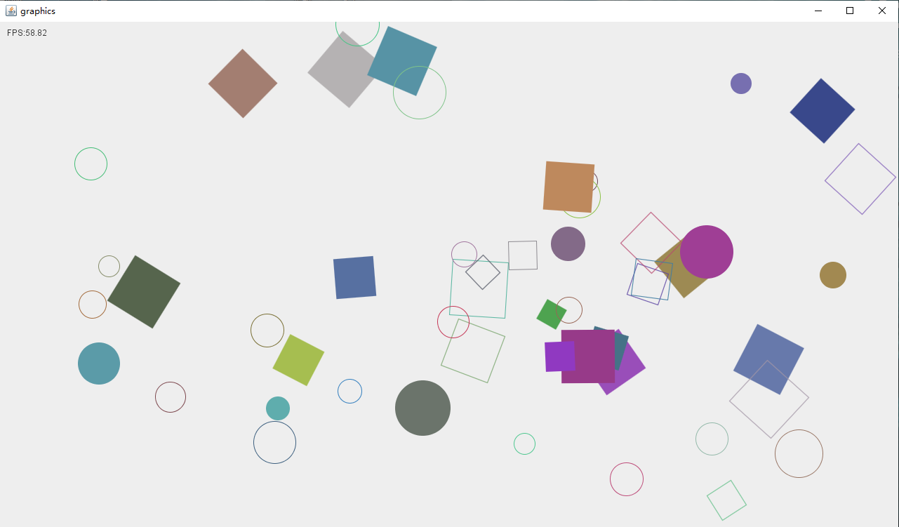

# Java-Graphics

## 中文

### 描述
关于如何编写一个java图形程序的简单粒子。

### 如何使用
1. 打开任何你喜欢的java IDE
2. 创建Main.java文件
3. 将本仓库中Main.java中的代码复制到第二步创建的文件中
4. 运行Main

### 运行效果

## English

### Description
Simple demo about how to write a java graphics program.

### How to use
1. Open any java IDE you prefer
2. Create a Main.java file
3. Copy code from Main.java in this repository to your source code file created in step 2
4. Run Main

### Runtime effect

